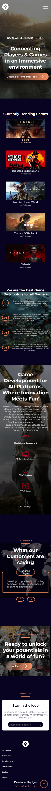
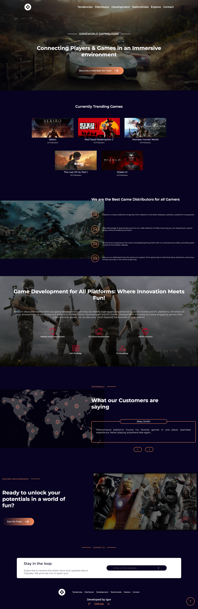

# Odyssey

Welcome to Odyssey, a LAnding Page showcasing a gaming platform.

## Image Preview

# Objective

Despite all the Front-End development, this project was created as the starting point for my studies related to Front-End testing using Jest and Testing Library.

## Technologies

-   React.js
-   TypeScript
-   Styled-components
-   React Hook Form
-   Zod
-   Jest
-   Testing Library

## User-Facing Features

-   **Simplified Landing Page:** The project is a Landing Page, providing a direct and focused experience with all essential content presented on a single page.
-   **Responsiveness:** The website provides a consistent and optimized experience across all screen sizes, ensuring smooth navigation and an appealing visual presentation on any device.
-   **Intuitive Navigation:** Users experience intuitive navigation throughout the page. The inclusion of links in both the navbar and footer facilitates quick access to key sections, while a "Scroll to Top" button provides a convenient way to return to the top of the page, ensuring a smooth and efficient user experience.
-   **Simple Signup:** The Landing Page features a streamlined form that only asks for your email address.

## Developer-Centric Resources

-   **Consistent Formatting:** The source code adheres to consistent formatting standards, thanks to the integration of ESLint and Prettier.
-   **Absolute Imports:** Maintain code organization and clarity by leveraging absolute imports. The adoption of absolute imports simplifies module referencing, contributing to a cohesive project structure and an efficient, comprehensible development experience.
-   **Implemented Unit Tests:** Strengthen code robustness through comprehensive implementation of unit tests.

## Deploy

-   [Access Odyssey](https://odyssey-ig.vercel.app/)

## How to Use

-   Clone this repository to your computer
-   Install dependencies using the command: `pnpm i`
-   Start the development server with: `pnpm dev`
-   Open your browser and navigate to host to view: `http://localhost:3000/`
-   Run tests using the command: `pnpm test`
